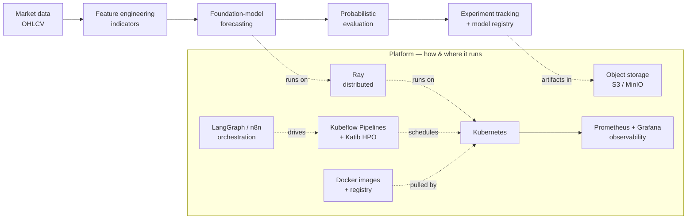

# 8-Week Learning Plan — ML & Time Series + Tools & Platform

A self-paced curriculum for a university-starting learner with basic Python and basic AI knowledge.

**Topics are inspired by a real ML system** (crypto time-series → feature engineering → foundation-model forecasting → probabilistic evaluation, running on Kubernetes/Ray/Kubeflow). **All learning material is free and from the public internet** — none of the project's own source code is used.

## Goal

By the end, the learner can explain **what** a system like this does *and* **how/where** it runs end to end:

> market data → features → foundation-model forecasting → probabilistic evaluation → experiment tracking → model registry → hyperparameter optimization → containers → object storage → Kubernetes → Ray → Kubeflow Pipelines → Katib → observability → workflow/agent orchestration.

## How it's structured

The plan is split into **two equal halves**:

| Part | Weeks | Days | Focus |
| --- | --- | --- | --- |
| **Part A** | 1–4 | 20 | ML & Time Series — *what it does* |
| **Part B** | 5–8 | 20 | Tools & Platform / MLOps — *how & where it runs* |

**Cadence:** 8 weeks × 5 study days = 40 days. ~60–90 min/day early on, ~90–150 min/day for later hands-on labs. Weekends are for catch-up and repeating labs.

**Two ways to run it:**

- **Sequential** — finish Part A, then Part B (8 weeks).
- **Interleaved** — ML in the morning, one tool/platform topic in the evening, to compress the calendar to ~5–6 weeks.

All hands-on platform work uses **free local tools** (minikube/kind, Docker Desktop, local MinIO, free W&B tier, Google Colab). **No access to any private/production cluster is required.**

---

# Part A — ML & Time Series (Weeks 1–4)

## Week 1 — Foundations: Python, data, how ML thinks *(light)*

| Day | Topic | Resources | Hands-on |
| --- | --- | --- | --- |
| 1 | Setup + Python refresher | [Python Tutorial](https://docs.python.org/3/tutorial/) · [Kaggle: Python](https://www.kaggle.com/learn/python) | Run a Jupyter notebook; variables, loops, functions |
| 2 | NumPy & vectorized thinking | [NumPy for Beginners](https://numpy.org/doc/stable/user/absolute_beginners.html) | Array math, mean/std |
| 3 | pandas for tabular data | [Kaggle: Pandas](https://www.kaggle.com/learn/pandas) · [pandas getting started](https://pandas.pydata.org/docs/getting_started/index.html) | Load a CSV, filter, groupby |
| 4 | Plotting & EDA | [Kaggle: Data Visualization](https://www.kaggle.com/learn/data-visualization) · [Matplotlib tutorials](https://matplotlib.org/stable/tutorials/index.html) | Line / scatter / histogram |
| 5 | What is machine learning? | [Google ML Crash Course](https://developers.google.com/machine-learning/crash-course/linear-regression) · [Kaggle: Intro to ML](https://www.kaggle.com/learn/intro-to-machine-learning) | Train a tiny scikit-learn model |

## Week 2 — Time series + the financial-data domain *(light → medium)*

| Day | Topic | Resources | Hands-on |
| --- | --- | --- | --- |
| 6 | Time-series fundamentals (trend, seasonality, stationarity, splits, horizon) | [Forecasting: Principles & Practice, ch. 1–3](https://otexts.com/fpp3/) · [Kaggle: Time Series](https://www.kaggle.com/learn/time-series) | Decompose a series |
| 7 | Candlesticks & crypto market data (OHLCV, pairs, klines) | [Investopedia: Candlesticks](https://www.investopedia.com/trading/candlestick-charting-what-is-it/) · [python-binance docs](https://python-binance.readthedocs.io/) | Explore an OHLCV CSV |
| 8 | Indicators / feature engineering (MA, RSI, MACD, Bollinger, returns, volatility) | [RSI](https://www.investopedia.com/terms/r/rsi.asp) · [MACD](https://www.investopedia.com/terms/m/macd.asp) · [`ta` library](https://technical-analysis-library-in-python.readthedocs.io/) · [Kaggle: Feature Engineering](https://www.kaggle.com/learn/feature-engineering) | Compute indicators with pandas |
| 9 | Data cleaning & leakage / look-ahead bias | [Kaggle: Data Cleaning](https://www.kaggle.com/learn/data-cleaning) · [FPP3: Accuracy](https://otexts.com/fpp3/accuracy.html) | Fill gaps; shift features to avoid leakage |
| 10 | Classic forecasting baselines (naive, seasonal-naive, ARIMA/ETS intuition) | [FPP3: Toolbox](https://otexts.com/fpp3/toolbox.html) · [FPP3: ARIMA](https://otexts.com/fpp3/arima.html) | Naive + seasonal-naive baseline + error |

## Week 3 — ML core + deep learning + PyTorch *(medium)*

| Day | Topic | Resources | Hands-on |
| --- | --- | --- | --- |
| 11 | Regression, loss, gradient descent | [MLCC: Linear Regression](https://developers.google.com/machine-learning/crash-course/linear-regression) | Fit a regression by hand + sklearn |
| 12 | Overfitting, validation & metrics (MAE/RMSE/MAPE/MASE; CRPS, quantile loss, coverage) | [MLCC: Overfitting](https://developers.google.com/machine-learning/crash-course/overfitting) · [FPP3: Accuracy](https://otexts.com/fpp3/accuracy.html) · [MASE](https://en.wikipedia.org/wiki/Mean_absolute_scaled_error) | Compute MASE on a backtest |
| 13 | Neural-network intuition + PyTorch basics | [3Blue1Brown: Neural Networks](https://www.3blue1brown.com/topics/neural-networks) · [PyTorch: Learn the Basics](https://pytorch.org/tutorials/beginner/basics/intro.html) | Tensors & autograd |
| 14 | Training loop + PyTorch Lightning | [PyTorch Quickstart](https://pytorch.org/tutorials/beginner/basics/quickstart_tutorial.html) · [Lightning docs](https://lightning.ai/docs/pytorch/stable/) | Train an MLP |
| 15 | Transformers & attention | [The Illustrated Transformer](https://jalammar.github.io/illustrated-transformer/) · [MLCC: LLMs](https://developers.google.com/machine-learning/crash-course/llm) | Diagram attention in your own words |

## Week 4 — Time-series foundation models *(medium → advanced)*

| Day | Topic | Resources | Hands-on |
| --- | --- | --- | --- |
| 16 | Deep learning for time series + GluonTS | [HF: Probabilistic TS with Transformers](https://huggingface.co/blog/time-series-transformers) · [GluonTS docs](https://ts.gluon.ai/stable/) | Run the HF blog notebook |
| 17 | Foundation models & zero-shot forecasting | [Lag-Llama (GitHub)](https://github.com/time-series-foundation-models/lag-llama) · [paper](https://arxiv.org/abs/2310.08278) · [15-min video](https://www.youtube.com/watch?v=Mf2FOzDPxck) · [Chronos](https://github.com/amazon-science/chronos-forecasting) | Read + watch; note the idea of pretraining |
| 18 | Hands-on zero-shot | [Lag-Llama Colab Demo 1](https://colab.research.google.com/drive/1DRAzLUPxsd-0r8b-o4nlyFXrjw_ZajJJ?usp=sharing) · [Chronos-2 quickstart](https://github.com/amazon-science/chronos-forecasting/blob/main/notebooks/chronos-2-quickstart.ipynb) | Run zero-shot; vary context length |
| 19 | Fine-tuning a foundation model (transfer learning; tune context length + LR; early stopping) | [Lag-Llama Colab Demo 2](https://colab.research.google.com/drive/1uvTmh-pe1zO5TeaaRVDdoEWJ5dFDI-pA?usp=sharing) + README "Best Practices" | Fine-tune on a dataset |
| 20 | Probabilistic forecasting + covariates **+ Capstone A** | HF blog (probabilistic section) · Chronos covariates example | **End-to-end crypto forecast: baseline vs foundation model** |

---

# Part B — Tools & Platform / MLOps (Weeks 5–8)

## Week 5 — Developer toolbox & environment *(light → medium)*

| Day | Topic | Resources | Hands-on |
| --- | --- | --- | --- |
| 21 | Linux, command line & SSH (working on remote nodes) | [Ubuntu CLI tutorial](https://ubuntu.com/tutorials/command-line-for-beginners) · [Linux Journey](https://linuxjourney.com/) | Navigate, pipe, ssh into a VM |
| 22 | Git & GitHub (version control) | [Pro Git, ch. 1–3](https://git-scm.com/book/en/v2) · [GitHub Skills](https://skills.github.com/) | Branch, commit, open a PR |
| 23 | CI/CD with GitHub Actions (build/test/push automation) | [GitHub Actions docs](https://docs.github.com/en/actions/learn-github-actions) | Write a workflow that runs tests |
| 24 | Python environments & dependencies: Poetry | [Poetry docs](https://python-poetry.org/docs/) · [venv](https://docs.python.org/3/library/venv.html) | Create a project + lockfile |
| 25 | Notebooks + config: Jupyter/Jupytext + Hydra/YAML | [Jupyter docs](https://docs.jupyter.org/) · [Jupytext](https://jupytext.readthedocs.io/) · [Hydra](https://hydra.cc/docs/intro/) | Pair a notebook; read a Hydra config |

## Week 6 — Containers, storage, tracking, registry *(medium)*

| Day | Topic | Resources | Hands-on |
| --- | --- | --- | --- |
| 26 | Containers & Docker (images, layers, Dockerfile) | [Docker: Get Started](https://docs.docker.com/get-started/) | Build + run a container |
| 27 | Image registries (Docker Hub / Harbor) + why pre-bake ML images | [Docker Hub](https://docs.docker.com/docker-hub/) · [Harbor](https://goharbor.io/docs/) | Push an image to a registry |
| 28 | Object storage: S3 / MinIO (buckets, keys, boto3, `mc`) | [MinIO docs](https://min.io/docs/minio/linux/index.html) · [boto3 quickstart](https://boto3.amazonaws.com/v1/documentation/api/latest/guide/quickstart.html) | Run local MinIO; put/get an object |
| 29 | Experiment tracking: Weights & Biases (runs, metrics, sweeps, groups) | [W&B quickstart](https://docs.wandb.ai/quickstart/) | Log a training run |
| 30 | Model registry + metadata + databases (MLMD; Postgres for state) | [Kubeflow Model Registry](https://www.kubeflow.org/docs/components/model-registry/) · [PostgreSQL tutorial](https://www.postgresql.org/docs/current/tutorial.html) | Register a model version |

## Week 7 — Kubernetes & cluster operations *(medium → advanced)*

| Day | Topic | Resources | Hands-on |
| --- | --- | --- | --- |
| 31 | Kubernetes fundamentals (pods, deployments, services, namespaces) | [Kubernetes Basics](https://kubernetes.io/docs/tutorials/kubernetes-basics/) | Walk the interactive modules |
| 32 | Hands-on `kubectl` on a local cluster | [minikube](https://minikube.sigs.k8s.io/docs/start/) (or [kind](https://kind.sigs.k8s.io/)) · [kubectl reference](https://kubernetes.io/docs/reference/kubectl/) | Deploy + scale a sample app |
| 33 | Packaging k8s apps: Helm charts & manifests/YAML | [Helm quickstart](https://helm.sh/docs/intro/quickstart/) · [Workloads](https://kubernetes.io/docs/concepts/workloads/) | Install a chart; edit values |
| 34 | GPUs on Kubernetes (scheduling, node affinity, requests/limits) | [Scheduling GPUs](https://kubernetes.io/docs/tasks/manage-gpus/scheduling-gpus/) · [Assigning pods to nodes](https://kubernetes.io/docs/concepts/scheduling-eviction/assign-pod-node/) | Read a GPU pod spec |
| 35 | Cluster management & multi-tenant namespaces: Rancher | [Rancher docs](https://ranchermanager.docs.rancher.com/) · [RBAC good practices](https://kubernetes.io/docs/concepts/security/rbac-good-practices/) | Tour a cluster UI; explain RBAC |

## Week 8 — ML platform: pipelines, distributed, HPO, observability, agents *(advanced)*

| Day | Topic | Resources | Hands-on |
| --- | --- | --- | --- |
| 36 | Kubeflow Pipelines (DAGs, components, runs, experiments) | [KFP overview](https://www.kubeflow.org/docs/components/pipelines/overview/) · [getting started](https://www.kubeflow.org/docs/components/pipelines/getting-started/) · [Argo Workflows](https://argo-workflows.readthedocs.io/) | Read a compiled pipeline YAML |
| 37 | Distributed compute: Ray + Ray on Kubernetes (KubeRay, `runtime_env`) | [Ray getting started](https://docs.ray.io/en/latest/ray-overview/getting-started.html) · [Ray on Kubernetes](https://docs.ray.io/en/latest/cluster/kubernetes/index.html) | Parallelize a function with Ray |
| 38 | Hyperparameter optimization at scale: Ray Tune + Optuna; Katib | [Ray Tune](https://docs.ray.io/en/latest/tune/index.html) · [Optuna tutorial](https://optuna.readthedocs.io/en/stable/tutorial/index.html) · [Katib](https://www.kubeflow.org/docs/components/katib/) | Run a small Optuna study |
| 39 | Observability: Prometheus + Grafana (GPU framebuffer %, alerts) | [Prometheus overview](https://prometheus.io/docs/introduction/overview/) · [Grafana getting started](https://grafana.com/docs/grafana/latest/getting-started/) | Read a Grafana GPU panel |
| 40 | Orchestration/agents + **MLOps Capstone B** | [n8n docs](https://docs.n8n.io/) · [LangGraph](https://langchain-ai.github.io/langgraph/) · [Made With ML](https://madewithml.com/) · [Google MLOps guide](https://cloud.google.com/architecture/mlops-continuous-delivery-and-automation-pipelines-in-machine-learning) | **Whole-system architecture diagram + 20-min talk** |

---

## Graduation checks

- **End of Week 2:** explain OHLCV, compute an indicator, and describe data leakage.
- **End of Week 4 (Part A done):** run zero-shot **and** fine-tune a foundation forecasting model; read a probabilistic forecast; compare baseline vs model.
- **End of Week 5:** clone a repo, branch/commit/PR, set up a Poetry env, read a Hydra YAML.
- **End of Week 6:** build a Docker image, push to a registry, put/get an object in MinIO, log a W&B run.
- **End of Week 7:** deploy a pod/deployment/service on minikube via `kubectl` + a Helm chart; explain GPU scheduling + namespaces.
- **End of Week 8 (Part B done):** describe a KFP pipeline run, a Ray Tune sweep, and a Katib experiment; read a Grafana GPU panel; deliver the final architecture diagram + a 20-minute talk on **what it does *and* how/where it runs**.

## Concept map — how the pieces fit

## Notes & decisions

- **Balance:** 50/50 — 20 days ML + 20 days tools/platform.
- **Material:** 100% free public internet; the project's own code is intentionally excluded.
- **Stack mirrored:** Kubernetes, Kubeflow Pipelines, Ray/Ray Tune, Katib, PyTorch Lightning, Weights & Biases, MinIO/S3, Docker + Harbor, Helm, LangGraph, Prometheus/Grafana, Hydra, Poetry, Git/GitHub Actions, Rancher, n8n.
- **No private infra needed:** every lab runs on free local tooling or Google Colab.

### Open choices (tune to taste)

1. **Calendar** — 8 weeks sequential, or interleave Part A + Part B to finish in ~5–6 weeks. *(Interleave if motivated.)*
2. **Platform breadth vs depth** — keep Rancher/n8n/Argo as a light overview, or drop them and go deeper on the core four (K8s, KFP, Ray, W&B). *(Recommend overview + core depth.)*
3. **Portfolio** — add deliverables on Day 20 and Day 40 (GitHub repo + architecture diagram + short writeup). *(Recommended.)*
